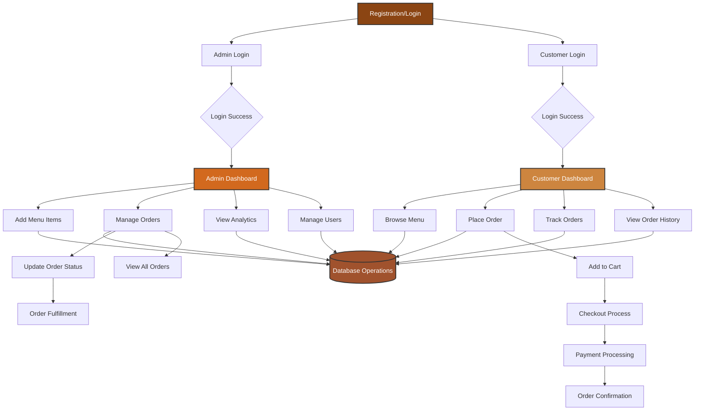

# Afforgato Coffee Shop System Design Flowchart

## System Components

### Entry Point
- **Registration/Login**: Main entry point for all users

### User Authentication
- **Admin Login**: Administrative access with elevated privileges
- **Customer Login**: Standard customer access for ordering

### Admin Dashboard Features
- **Add Menu Items**: Create and manage coffee shop menu
- **Manage Orders**: View, update, and process customer orders
- **View Analytics**: Business intelligence and reporting
- **Manage Users**: User account administration

### Customer Dashboard Features
- **Browse Menu**: View available coffee items and prices
- **Place Order**: Add items to cart and checkout
- **Track Orders**: Monitor order status and delivery
- **View Order History**: Access past order records

### Core Processes
- **Order Workflow**: Cart → Checkout → Payment → Confirmation
- **Order Management**: Status updates and fulfillment tracking
- **Database Operations**: Centralized data management for all functions
